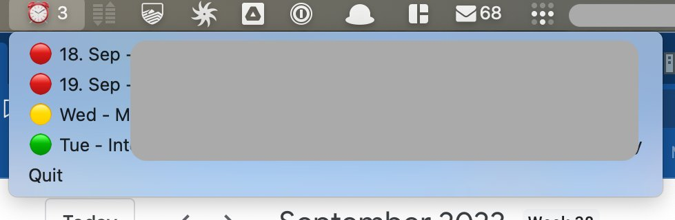

# Msana

Your friendly macOS Asana notifier ⏰. 



This macOS menu bar app shows your
- overdue tasks
- today tasks
- tasks within the next 7 days

This applies to all your tasks which are assigned to you and have a due date set.

Clicking on a tasks will bring you to the task in Asana.

## config

You need to have a config file in your home directory called .msana.json

### auth

You can get the auth information (Personal accesss token) from https://app.asana.com/0/my-apps.
Copy the resulting token.

### workspace

This is the workspace to access. You can get this information from https://app.asana.com/api/1.0/workspaces. 
Look for the 'gid'. This is the number you need to fill in 'workspace'.

### refresh_interval_seconds

Refresh interval for checking for updates.


```json
{
"auth":"1/xxxxxxxxxxxxxxxxxxxxxxx",
"workspace":"000000000000",
"refresh_interval_seconds":300
}

```